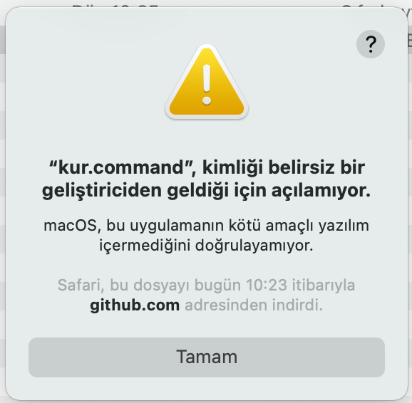
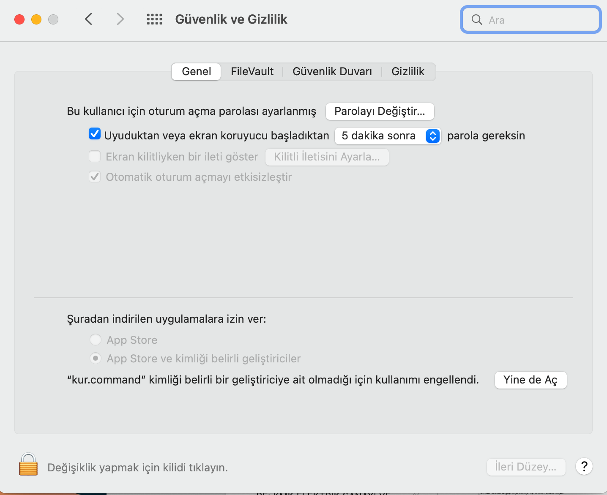
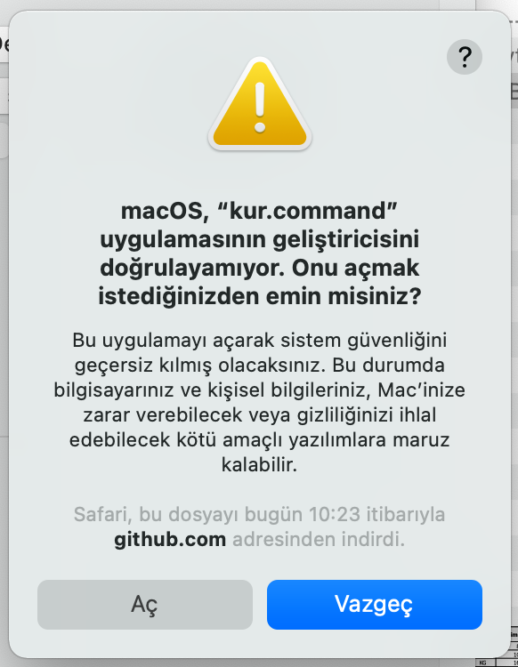
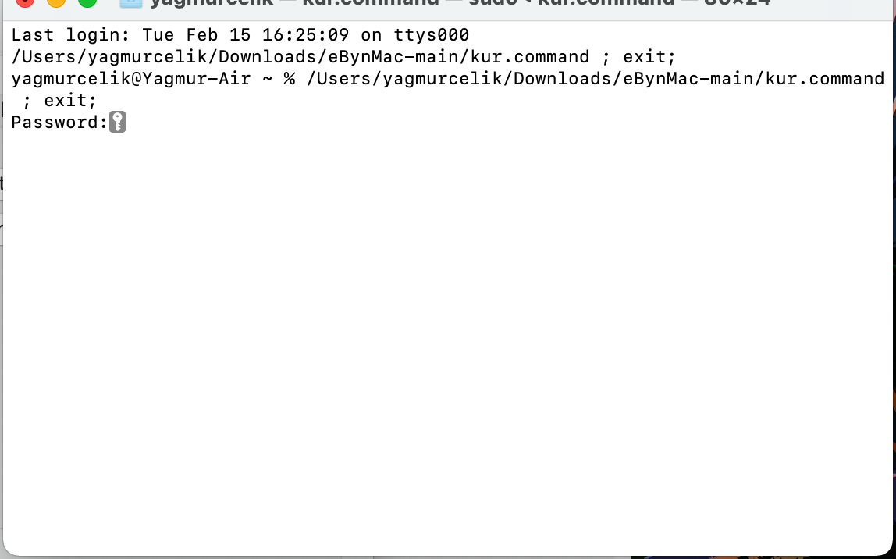
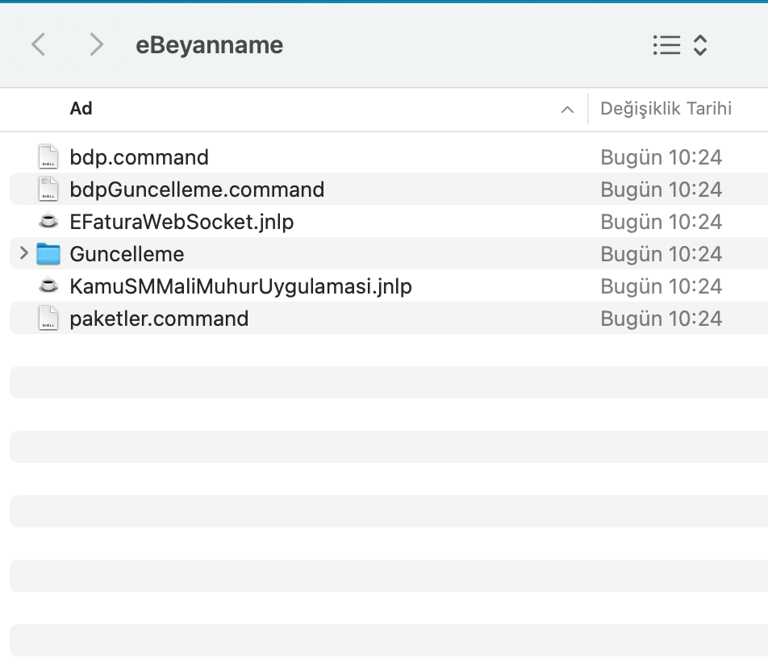
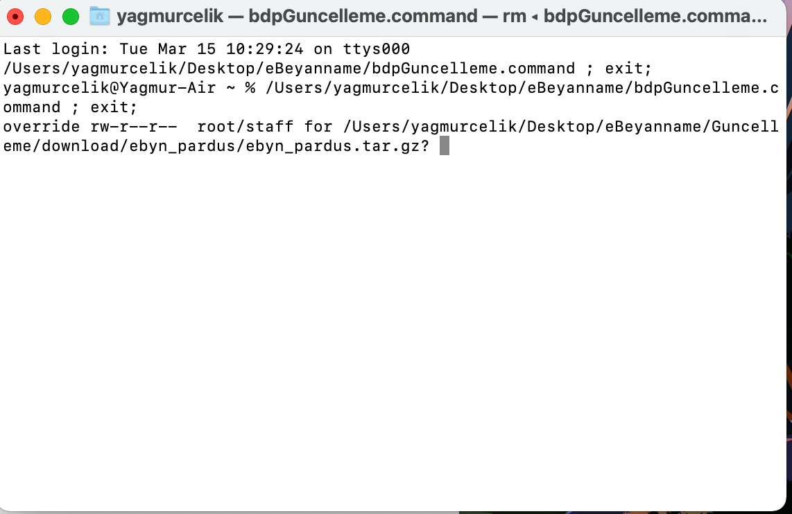

## eBeyanname Mac versiyon kurulumu Mali Mühür Ayarları

[Programı inddirmek için buraya tıklayın](https://github.com/furkanarici/eBynMac/archive/refs/heads/main.zip)

Gelir İdaresi Başkanlığına e-Beyannamelerin verilmesi için xml formatında beyannamelerin hazırlandığı programın Apple Mac bilgisayarlarda çalışması için gerekli kurulumların yapılması için hazırladığım komut dosyalarını içerir.

Ayrıca mac bilgisayarlarda mali mühürün çalışması için ilgili kurulumları yapar.

Kurulum Adımları

- zip dosyayı indirin
- kur.command dosyasını çalıştırın
- aşağıdaki pencere gelecek ve komut dosyasının güvenlik nedeniyle çalışmadığı belirtilecek. Tamam'a basın.

- Sistem tercihlerinden genel sekmesinde sağ alttaki Yine de aç butonunu tıklayın

- Açılan pencerede aç butonunu tıklayın

- Terminal açıldığında sizden bilgisayarınızı açarken kullandığınız şifreyi isteyecek girip enter'a basın. (şifreyi girerken yazmıyormuş hissine kapılabilirsiniz. ekranda bir değişiklik olmasa da doğru şifreyi girip enter'a basın.)

- İnternetten gerekli programları indirecek ve yükleme programlarını açacak.
- Açılan Java yükleme programlarını teker teker çalıştırın kurulumların tamamlanmasını bekleyin.
- İşlemler bittiğinde aşadğaki gibi masa üstünüzde eBeyanname adında bir klasör oluşacak

- Kalsör içindeki hiçbir şeyi silmeyin. e-Beyanname programına girmek için bdp.command dosyasını çalıştırın. Güvenlik nedeniyle açılmadığı mesajı alırsanız 3. ve 4. adımda olduğu gibi güvenlik ve gizlilik ekranında yine de aç diyerek ilerleyin.

### Güncelleme
- e beyanname yazılımının güncellenmesi gerektiği zaman yine massa üstündeki eBeyanname klasörünü açın. bdpGuncelleme.command dosyasını çalıştırn. 
- Açılan pencerede alttaki örnekte oldğu gibi soru sorulursa "y" tuşuna basıp "enter" a basın. Bu işlemi birkaç kez isteyebilir. 

kolay gelsin. 
